# About Scripts

## Explanation

In the Assets Scripts folder of the Project pane, there are C# scripts that communicate with the controls.

- Common
  - CommonImageProcessor
    - Common functions of Unity camera image processors.
  - CommonParameter
    - Various parameters are set.
  - CommonRateManager
    - Common functions for monitoring the progress of processing over time and filter functions.
  - CommonTransform
    - Defines common functions for coordinate transformation.
  - MessageStructure
    - Defines structures used for ROS topics.
  - SystemStructure
    - Defines common enumeration types and structures.
  - TrajectoryInterpolationManager
    - Trajectory interpolation functions.

- Input
  - InputManager
    - Performs PC input processing.
    - It is attached to the "KeyboardInput" game object.
  - KeyboardReceiver
    - Performs keyboard input processing.
  - GamepadReceiver
    - Performs gamepad input processing.

- CarryObject
  - CarryObjectController
    - Controls the object to be carried (in this case, a cup).
    - It is attached to the game object "CarryObjects".

- Environment
  - EnvironmentController
    - Controls the game environment, such as camera operations.
    - It is attached to the game object "Environment".

- Player
  - PlayerController
    - Controls the player.

- Robot
  - RobotController
    - Controls the robot.
    - Attached to the game object of the robot avatar.
  - HeadUnitController
    - Controls the HeadUnit.
  - EyeController
    - Controls eye movement.
  - NeckController
    - Controls head movement.
  - ArmUnitController
    - Controls ArmUnit.
  - WaistDownUnitController
    - Controls WaistDownUnit.
  - InverseKinematicsManager
    - Processes related to inverse kinematics algorithms.
  - SimpleStepInverseKinematics
    - Original inverse kinematics algorithm.
    - Not completed yet.
  - RigidBodyTree
    - Rigid body and joint expression.

- CommunicationReceiver
  - CommunicationReceiver
    - Receives from an external application.
    - It is attached to the game object "Communicator".
  - UDPReceiver
    - Receives data via UDP communication. However, the UDP communication function is not yet completed.
  - ROSReceiver
    - Receives data via ROS communication.
  - CommunicationSender
    - Transmits data to an external application.
    - It is attached to the game object "Communicator".
  - UDPSender
    - Sends via UDP communication. However, the UDP communication function is not yet completed.
  - ROSSender
    - Sends via ROS communication.

### Class Diagram

