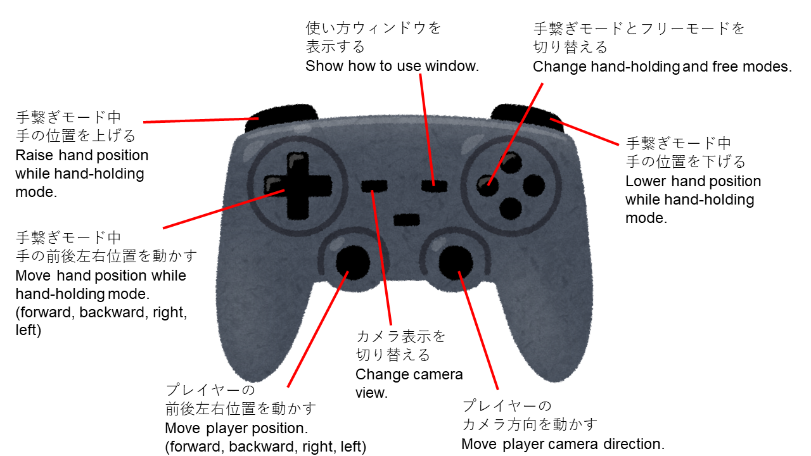

# 使い方

## キーボード操作について

キーボード操作一覧

| ボタン | 機能 |
| -- | -- |
| W | 前進 |
| S | 後退 |
| A | 反時計回りに回転 |
| D | 時計回りに回転 |
| Space | 入力モードの切替 |
| O | 運搬物を取る |
| P | 運搬物を置く |
| T | ロボットのモードを切り替える |
| F1 | カメラのモードを切り替える |

HAND_HOLDING モード中の手の位置の動かし方

| ボタン | 機能 |
| -- | -- |
| 矢印キー右 | ロボットから見てY軸正方向へ移動 |
| 矢印キー左 | ロボットから見てY軸負方向へ移動 |
| 矢印キー上 | ロボットから見てX軸負方向へ移動 |
| 矢印キー下 | ロボットから見てX軸正方向へ移動 |
| Shift + 矢印キー上 | ロボットから見てZ軸正方向へ移動 |
| Shift + 矢印キー下 | ロボットから見てZ軸負方向へ移動 |

## ゲームパッド操作一覧

## 移動について

キーを押した時の移動速度は、前進後退は 1[m/s] 、回転は 1[rad/s] です。

## 入力モードの切替について

実行中、キーボードのSpaceキーを押すことで、入力モードを切り替えることができます。起動時は COMMUNICATION モードになっています。

- COMMUNICATION モード
  - 外部アプリから入力でロボットを操作するモードです。
  - キーボードからの入力では、ロボットを動かすことができません。
- KEYBOARD モード
  - キーボードの前進、後退、回転入力を用いてロボットを操作するモードです。
  - 外部アプリからの入力では、ロボットを動かすことができません。

## 運搬について

ゲームオブジェクト「flasket」に置かれているカップを取ってトレーに乗せ、運び、机に置くことができます。

ロボットがカップに1[m]以内に近づいた時、カップを取ることができます。また、ロボットがカップを置く場所に1[m]以内に近づいた時、カップを置くことができます。

カップを置くことができる場所は、初期位置の flasket と、各椅子がある場所の机の上になります。

## ロボットのモードについて

実行中、キーボードのTキーを押すことで、ロボットのモードを切り替えることができます。

- CATERING モード
  - カフェで飲み物などをお客様のもとへ運ぶ動作を再現するモードです。
- HAND_HOLDING モード
  - 手繋ぎ制御での移動を再現するモードです。

## プレイヤーのモードについて

実行中、ゲームパッドのXボタンを押すことで、プレイヤーのモードを切り替えることができます。

- FREE モード
  - 自由に動くモードです。
- HAND_HOLDING モード
  - 自由に動き、かつロボットと手を繋いだ状態です。このモードに移行するには、ロボットがHAND_HOLDINGであり、ロボットから1.5m以内の距離にいなければなりません。
  - ロボットから1.5m以上離れた場合、自動的にFREEモードに遷移します。

## カメラのモードについて

実行中、キーボードのF1キーを押すことで、カメラのモードを切り替えることができます。起動時は FAR になっています。

- FAR モード
  - エリア全体を広く映すモードです。
- NEAR モード
  - ロボットを詳細に見ることができるモードです。

## プレイヤー操作時、カメラのモードについて

実行中、プレイヤーが存在するときは、ゲームパッドのSelectボタンで画面表示を切り替えることができます。

- NORMAL モード
  - 左側にプレイヤー視点、右側にエリア全体を映すモードです。
- FOCUS_TO_PLAYER_VIEW モード
  - プレイヤー視点のみを表示するモードです。

## ROS通信

ROS通信を行う場合は、事前に ROS TCP Endpoint を起動する必要があります。Maid Robot System では、ROS2を用いています。

ROS TCP Endpoint は、事前にインストール作業が必要になります。作業の詳細についてはインストール方法の資料を参照してください。

[インストール方法](../install/install_doc.md)

### ROS TCP Endpoint の起動

ROSコマンドを実行するための、セットアップコマンドを実行します。Ubuntu起動時にセットアップコマンドを実行するようにしている場合は不要です。

次に、以下のコマンドを実行します。

> ros2 run ros_tcp_endpoint default_server_endpoint --ros-args -p ROS_IP:=127.0.0.1

上記コマンドでは、IPアドレスは 127.0.0.1 に設定していますが、別のアドレスを使うこともできます。その場合は、Unity 編集画面のメニューバーの「Robotics」「ROS Settings」から、IPアドレスをその別のアドレスに変更する必要があります。

### ROS トピック

送受信しているトピックは以下の通りです。

| 受信トピック名 | データ型 | 備考 |
| ---- | ---- | ---- |
| maid_robot_system/Misen/waist_down_unit/controller/move_velocity_reference | geometry_msgs/Twist | ロボットの3軸速度、3軸角速度指令値です。ただし、現時点では、受け取った指令値の内、x軸方向速度とz軸周りの角速度のみ、指令値として用います。 |
| maid_robot_system/Misen/head_unit/logic/eye | maid_robot_system_interfaces/MrsEyeMsg | 目の角度指令値です。左右の目のピッチ角、ヨー角方向の角度指令値を受け取ります。 |
| maid_robot_system/Misen/head_unit/logic/neck | maid_robot_system_interfaces/MrsNeckMsg | 頭の角度指令値です。クオータニオンで受け取ります。 |
| maid_robot_system/Misen/head_unit/logic/lip | maid_robot_system_interfaces/MrsLipMsg | 口の開く度合の指令値を受け取ります。現在、この指令値は用いられていません。 |
| maid_robot_system/Misen/head_unit/logic/status | maid_robot_system_interfaces/MrsHeadStatusMsg | 目のカメラで人を検知しているかどうかの情報を受け取ります。 |

 

| 送信トピック名 | データ型 | 備考 |
| ---- | ---- | ---- |
| maid_robot_system/Misen/waist_down_unit/controller/robot_position_orientation | geometry_msgs/PoseStamped | ロボットの現在のXYZ位置、クオータニオンで表現された姿勢の情報です。本トピックは0.1[s]間隔で送信されます。 |
| maid_robot_system/Misen/arm_unit/controller/hand_position | geometry_msgs/PointMsg | 手繋ぎモード時の手の位置情報です。本トピック0.1[s]間隔で送信されます。 |
| maid_robot_system/Misen/head_unit/controller/topic_image/image/right | sensor_msgs/Image | 右目のカメラ画像です。本トピック0.1[s]間隔で送信されます。 |
| maid_robot_system/Misen/head_unit/controller/topic_image/image/left | sensor_msgs/Image | 左目のカメラ画像です。本トピック0.1[s]間隔で送信されます。 |

 

「maid_robot_system_interfaces」は、MaidRobotSystemのカスタムメッセージです。詳細については以下リンク先をご参照ください。

<https://github.com/MaSiRoProjectOSS/MaidRobotSystem/tree/main/src/planetary_module/ros/package/maid_robot_system_interfaces>

## MaidRobotSystem について

顔の認識と手繋ぎ制御を再現するためには、MaidRobotSystemと通信させる必要があります。MaidRobotSystemについては、以下のリンク先をご参照ください。

<https://github.com/MaSiRoProjectOSS/MaidRobotSystem>
