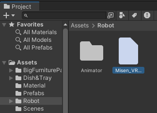

# インストール方法

## 目次

<!-- @import "[TOC]" {cmd="toc" depthFrom=2 depthTo=3 orderedList=false} -->
<!-- code_chunk_output -->

- [目次](#目次)
- [1. メイドロボットのアバターを準備する](#1-メイドロボットのアバターを準備する)
- [2. Unity をセットアップ](#2-unity-をセットアップ)
  - [2.1. Unity Hub をインストール](#21-unity-hub-をインストール)
  - [2.2. Unity Editor をインストール](#22-unity-editor-をインストール)
  - [2.3. 「MaidRobotCafe」プロジェクトの読み込み](#23-maidrobotcafeプロジェクトの読み込み)
  - [2.4. アセットをインストールする](#24-アセットをインストールする)
  - [2.5. ロボットを再配置する](#25-ロボットを再配置する)
- [3. ROSのセットアップ](#3-rosのセットアップ)
  - [3.1. ROS環境のセットアップ](#31-ros環境のセットアップ)
  - [3.2. ROS TCP Endpoint をセットアップ](#32-ros-tcp-endpoint-をセットアップ)
  - [3.3. Unity側（ROS TCP Connector）のセットアップ](#33-unity側ros-tcp-connectorのセットアップ)
- [4. 実行ボタンを押す](#4-実行ボタンを押す)

<!-- /code_chunk_output -->

## 1. メイドロボットのアバターを準備する

メイドロボットのアバターは.vrmファイルの形式で保存され、そのファイルから Unity へインポートしています。ロボットは Vroid Studio など用いて作ることができます。

## 2. Unity をセットアップ

Unity のインストール方法についての詳細はリンク先をご確認ください。

<https://docs.unity3d.com/2022.3/Documentation/Manual/GettingStartedInstallingUnity.html>

以降では、Unity Hub をインストールしてから Unity Editor をインストールする手順を紹介しています。

### 2.1. Unity Hub をインストール

最初に Unity Hub をインストールします。以下のリンク先からダウンロードすることができます。

<https://unity.com/download>

### 2.2. Unity Editor をインストール

Unity Editorは、「MaidRobotCafe」プロジェクトを読み込む時に、その「MaidRobotCafe」のバージョンに合ったものをインストールできます。したがって、事前にインストールしておく必要はありません。

Unity Hub を起動し、「Installs」から「Install Editor」クリックしてインストールします。推奨バージョンについては、以下のリンク先をご確認ください。

[アプリとサポートバージョン](../version/support_version.md)

### 2.3. 「MaidRobotCafe」プロジェクトの読み込み

本リポジトリの「MaidRobotCafe」フォルダの中のファイルが、Unityのプロジェクト一式です。以下のリンク先の最新バージョンのzipファイルをダウンロードし、解凍してください。

<https://github.com/MaSiRoProjectOSS/MaidRobotSimulator/releases>

解凍後、Unity Hub から、解凍したフォルダの中にある「MaidRobotCafe」フォルダを指定して開きます。

この時、一致するバージョンのUnity Editorがインストールされていない場合は、インストールするためのウィンドウが開きます。

最初は Unity 実行用のファイルを展開する必要があるため、編集画面が現れるまでに時間がかかる場合があります。

また、最初はシーンが選択されていませんので、「Project」ペインの「Assets」「Scenes」から「CaffeT」をダブルクリックして開きます。

### 2.4. アセットをインストールする

Unity Asset Store から、以下のアセットをインストールします。

- Big Furniture Pack
  - <https://assetstore.unity.com/packages/3d/props/furniture/big-furniture-pack-7717>
- Dish&Tray
  - <https://assetstore.unity.com/packages/3d/props/interior/dish-tray-5333>
- White Porcelain Dish Set Demo
  - <https://assetstore.unity.com/packages/3d/white-porcelain-dish-set-demo-82858>

アセットのインストール方法については、以下リンク先をご参照ください。

<https://docs.unity3d.com/2022.3/Documentation/Manual/AssetPackagesPurchase.html>

### 2.5. ロボットを再配置する

初回は.vrmファイルをうまく読み込めないので、下記の手順で一度.vrmファイルを削除し、再度インポートを行います。

#### 2.5.1. 「.vrm」ファイルをコピーする

本リポジトリの「MaidRobotCafe」「Assets」「Robot」フォルダを開きます。「Misen_VRM_1.vrm」ファイルを別のフォルダへコピーします。

もしくは、以下のVroid Hubからモデルファイルをダウンロードし、ファイル名を「Misen_VRM_1.vrm」に変更します。

<https://hub.vroid.com/characters/1254861402411331672/models/5998322075644097762>

#### 2.5.2. 「.vrm」ファイルを削除する

Unity の編集画面で、「Project」ペインの「Assets」「Robot」フォルダを選択します。「Misen_VRM_1」をクリックし、Deleteキーを入力して削除します。

#### 2.5.3. 「.vrm」ファイルをドラッグアンドドロップする

節（2.5.1.）でコピーした「Misen_VRM_1.vrm」ファイルを、Unity 編集画面の「Robot」フォルダへドラッグアンドドロップします。

これにより、ロボットが正常に読み込まれるようになります。

## 3. ROSのセットアップ

ROS TCP Endpoint を起動するためには、ROSのビルド環境を整える必要があります。Windowsで行う場合、WSL2のUbuntuにて、ROS TCP Endpoint を起動できます。以下に、その例を示します。

### 3.1. ROS環境のセットアップ

ROS環境が無い場合は、最初にWSL2を用いてUbuntuをインストールし、ROS環境のセットアップを行います。

インストール方法については、以下リンク先をご参照ください。

<https://docs.ros.org/en/humble/Installation.html>

### 3.2. ROS TCP Endpoint をセットアップ

以下のGitHubリポジトリをクローンします。クローンは、ROSのワークスペースの「src」ディレクトリにて行います。

<https://github.com/Unity-Technologies/ROS-TCP-Endpoint>

ROS2を用いる場合は、クローンした「ROS-TCP-Endpoint」のブランチを「main-ros2」に切り替えます。

以下のコマンドで、クローンとブランチの切替を一度に行うことができます。

> git clone -b main-ros2 <https://github.com/Unity-Technologies/ROS-TCP-Endpoint.git>

次に、「ROS-TCP-Endpoint」をビルドします。ROS2によるビルドは以下のコマンドで行うことができます。

> colcon build --merge-install

### 3.3. Unity側（ROS TCP Connector）のセットアップ

メニューバーの「Robotics」「ROS Settings」をクリックします。Maid Robot System では、基本的に ROS2 を用います。従って、Protocol を ROS2 に設定し、ROS IP Address を 127.0.0.1に、ROS Port を 10000 に設定することを推奨します。

この作業を行うと、「Assets」に「Resources」というフォルダが作成され、ROSの設定ファイルが追加されます。

実際にROS2通信を行うためには、ROS TCP Endpoint を事前に起動する必要があります。ROS TCP Endpoint の起動方法については、使い方資料をご参照ください。

[使い方](../how_to_use/how_to_use_doc.md)

## 4. 実行ボタンを押す

実行ボタンをクリックして、エラー無く動作することを確認します。この時、いくつか警告が発生している場合があります。

「Identifier uniqueness violation: 'Name:VRM1 ~~」という警告は、無視しても問題ありません。

「No settings for ROSConnection.instance! ~~」という警告は、「6. ROS接続設定を行う」を行っていれば発生しません。

「Connection to 127.0.0.1:10000 failed」という警告は、ROS TCP Endpoint が起動していない、通信できない場合に発生します。
