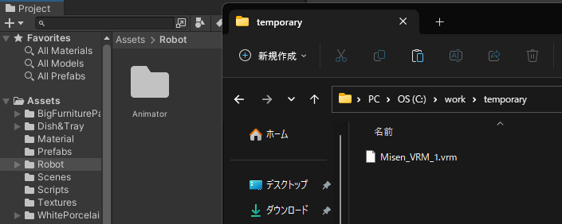

# Installation Method

## Table of Contents

<!-- @import "[TOC]" {cmd="toc" depthFrom=2 depthTo=3 orderedList=false} -->
<!-- code_chunk_output -->

- [Table of Contents](#table-of-contents)
- [1. Prepare the Avatar of the Maid Robot](#1-prepare-the-avatar-of-the-maid-robot)
- [2. Set up Unity](#2-set-up-unity)
  - [2.1. Install Unity Hub](#21-install-unity-hub)
  - [2.2. Install Unity Editor](#22-install-unity-editor)
  - [2.3. Load the "MaidRobotCafe" Project](#23-load-the-maidrobotcafe-project)
  - [2.4. Install Assets](#24-install-assets)
  - [2.5. Reposition the Robot](#25-reposition-the-robot)
- [3. Set up ROS](#3-set-up-ros)
  - [3.1. Set up ROS Environment](#31-set-up-ros-environment)
  - [3.2. Set up ROS TCP Endpoint](#32-set-up-ros-tcp-endpoint)
  - [3.3. Set up Unity Side (ROS TCP Connector)](#33-set-up-unity-side-ros-tcp-connector)
- [4. Press the Run Button](#4-press-the-run-button)

<!-- /code_chunk_output -->

## 1. Prepare the Avatar of the Maid Robot

The avatar of the maid robot is saved in the .vrm file format and imported from that file into Unity. The robot can be created using Vroid Studio or similar tools.

## 2. Set up Unity

For details on how to install Unity, please check the link.

<https://docs.unity3d.com/2021.3/Documentation/Manual/GettingStartedInstallingUnity.html>

### 2.1. Install Unity Hub

First, install Unity Hub. You can download it from the link below.

<https://unity.com/download>

### 2.2. Install Unity Editor

Launch Unity Hub, go to "Installs", click on "Install Editor" and install it. For the recommended version, please check the link below.

[App and Support Versions](../version/support_version_en.md)

### 2.3. Load the "MaidRobotCafe" Project

The files in the "MaidRobotCafe" folder of this repository are the complete Unity project. Please download the latest version of the zip file from the link below and unzip it.

<https://github.com/MaSiRoProjectOSS/MaidRobotSimulator/releases>

After unzipping, open the "MaidRobotCafe" folder inside the unzipped folder from Unity Hub.

Initially, it may take some time for the editing screen to appear because you need to deploy the files for running Unity.

Also, initially no scene is selected, so open "CaffeT" by double-clicking it from "Assets" "Scenes" in the "Project" pane.

### 2.4. Install Assets

Install the following assets from the Unity Asset Store.

- Big Furniture Pack
  - <https://assetstore.unity.com/packages/3d/props/furniture/big-furniture-pack-7717>
- Dish&Tray
  - <https://assetstore.unity.com/packages/3d/props/interior/dish-tray-5333>
- White Porcelain Dish Set Demo
  - <https://assetstore.unity.com/packages/3d/white-porcelain-dish-set-demo-82858>
- Starter Assets - Third Person Character Controller | URP
  - <https://assetstore.unity.com/packages/essentials/starter-assets-third-person-character-controller-urp-196526>

For instructions on how to install assets, please refer to the link below.

<https://docs.unity3d.com/2021.3/Documentation/Manual/AssetPackagesPurchase.html>

### 2.5. Reposition the Robot

The first time, the .vrm file may not be loaded correctly, so follow the steps below to delete the .vrm file once and re-import it.

#### 2.5.1. Copy the ".vrm" File

Open the "MaidRobotCafe", "Assets", "Robot" folder of this repository. Copy the "Misen_VRM_1.vrm" file to another folder.

Alternatively, download the model file from the Vroid Hub below and change the file name to "Misen_VRM_1.vrm".

<https://hub.vroid.com/characters/1254861402411331672/models/5998322075644097762>

#### 2.5.2. Delete the ".vrm" File

In the Unity editing screen, select the "Assets", "Robot" folder in the "Project" pane. Click on "Misen_VRM_1" and press the Delete key to delete it.

#### 2.5.3. Drag and Drop the ".vrm" File

Drag and drop the "Misen_VRM_1.vrm" file you copied in section (2.5.1.) into the "Robot" folder in the Unity editing screen.

This will allow the robot to be loaded correctly.

## 3. Set up ROS

In order to launch the ROS TCP Endpoint, you need to set up the ROS build environment. If you are using Windows, you can launch the ROS TCP Endpoint on Ubuntu in WSL2. Here is an example.

### 3.1. Set up ROS Environment

If you do not have a ROS environment, first install Ubuntu using WSL2 and set up the ROS environment.

For installation instructions, please refer to the link below.

<https://docs.ros.org/en/humble/Installation.html>

### 3.2. Set up ROS TCP Endpoint

Clone the following GitHub repository. The clone is done in the "src" directory of the ROS workspace.

<https://github.com/Unity-Technologies/ROS-TCP-Endpoint>

If you are using ROS2, switch the branch of the cloned "ROS-TCP-Endpoint" to "main-ros2".

You can clone and switch branches at once with the following command.

> git clone -b main-ros2 https://github.com/Unity-Technologies/ROS-TCP-Endpoint.git

Next, build the "ROS-TCP-Endpoint". You can build with ROS2 using the following command.

> colcon build --merge-install

### 3.3. Set up Unity Side (ROS TCP Connector)

Click on "Robotics", "ROS Settings" in the menu bar. The Maid Robot System basically uses ROS2. Therefore, it is recommended to set the Protocol to ROS2, the ROS IP Address to 127.0.0.1, and the ROS Port to 10000.

When you do this, a folder called "Resources" is created in "Assets", and the ROS configuration file is added.

In order to actually perform ROS2 communication, you need to start the ROS TCP Endpoint in advance. For how to start the ROS TCP Endpoint, please refer to the usage documentation.

[How to Use](../how_to_use/how_to_use_doc_en.md)

## 4. Press the Run Button

Click the Run button to confirm that it works without errors. At this time, some warnings may occur.

The warning "Identifier uniqueness violation: 'Name:VRM1 ~~" can be ignored.

The warning "No settings for ROSConnection.instance! ~~" will not occur if you have performed "6. Set up ROS Connection".

The warning "Connection to 127.0.0.1:10000 failed" occurs when the ROS TCP Endpoint is not running or cannot communicate.

